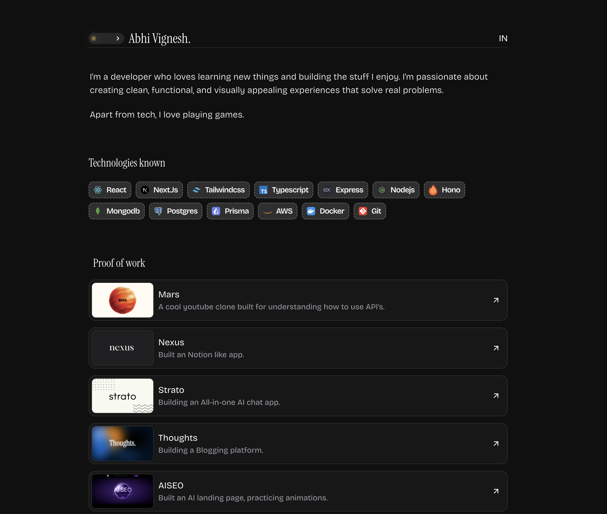

# AbhiVignesh — Portfolio Website

A modern, responsive portfolio website built with cutting-edge web technologies to showcase projects, skills, and experience.

## Tech Stack

### Core Framework & Language
- **Next.js 15.3.2** – React framework with powerful server-side rendering, routing, and optimization
- **React 19** – Latest React version for building interactive user interfaces
- **TypeScript** – Type-safe JavaScript for better code quality and developer experience

### Styling & UI
- **Tailwind CSS 4** – Utility-first CSS framework for rapid and responsive design
- **shadcn/ui** – Beautiful, accessible UI components built on Radix UI primitives
- **Radix UI** – Unstyled, accessible component primitives
  - Avatar, Separator, Slot, Tooltip components
- **Motion** – Powerful animation library for smooth, performant animations
- **next-themes** – Seamless dark mode support with system preference detection

## License

Private project - All rights reserved.
